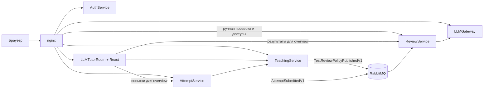
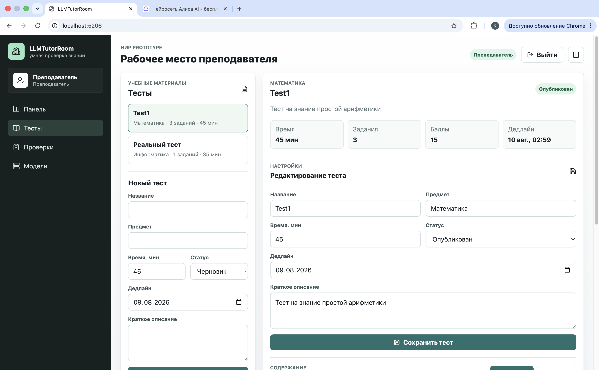
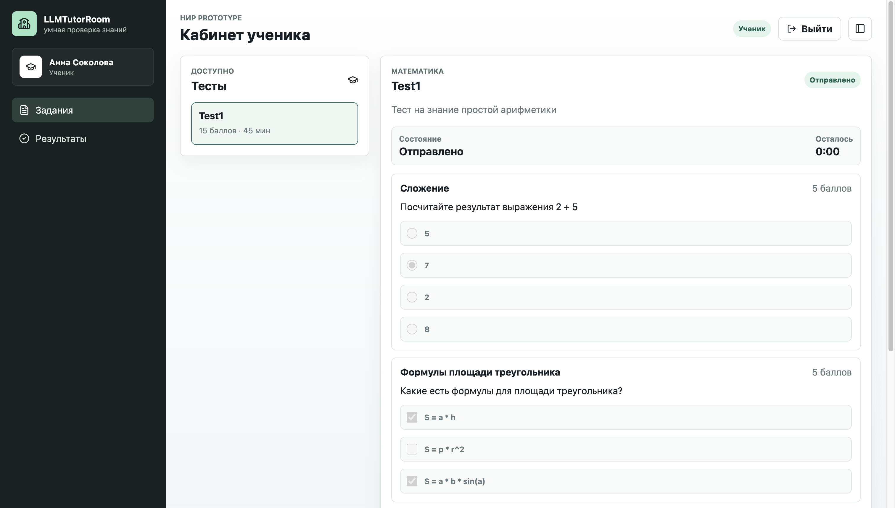

# LLMGateway

Микросервисная учебная система для создания версионируемых тестов, прохождения
попыток и автоматической, ручной или LLM-проверки ответов.

Преподаватель готовит черновик новой версии теста и явно публикует его. Ученик
проходит зафиксированную версию с серверным таймером. После отправки отдельный
`ReviewService` сопоставляет ответы с правилами этой версии и управляет всей
проверкой. `LLMGateway` скрывает конкретные LLM provider-ы и deployment-ы.

## Возможности

- роли `Admin`, `Teacher` и `Student` с JWT-аутентификацией;
- неизменяемые опубликованные версии тестов и отдельный редактируемый черновик;
- задания с одним ответом, несколькими ответами и свободным текстом;
- серверный таймер, autosave и продолжение попытки после перезагрузки;
- автоматическая, ручная и LLM-проверка в одном результате;
- повтор LLM-проверки при временной недоступности модели без автоматического
  перевода задания в ручной режим;
- персональные доступы преподавателей к моделям и квоты проверок;
- история результатов с фильтрацией по версиям и постраничной загрузкой;
- transactional outbox, inbox и RabbitMQ для надёжной доставки событий.

## Архитектура



| Проект | Ответственность | Документация |
| --- | --- | --- |
| `AuthService` | Пользователи, роли, пароли и JWT | [Подробнее](docs/auth-service.md) |
| `TeachingService` | Тесты, задания, версии и опубликованные правила проверки | [Подробнее](docs/teaching-service.md) |
| `AttemptService` | Попытки, ответы, серверный таймер и отправка работ | [Подробнее](docs/attempt-service.md) |
| `LLMTutorRoom` | React-приложение и web-фасад для сборки overview | [Подробнее](docs/llm-tutor-room.md) |
| `ReviewService` | Результаты, ручная и LLM-проверка, квоты и очередь обработки | [Подробнее](docs/review-service.md) |
| `LLMGateway` | Каталог моделей, deployment-ы, лимиты и вызов provider-а | [Подробнее](docs/llm-gateway.md) |

Начать знакомство с системой лучше с [общей архитектуры](docs/architecture.md).
Полный индекс находится в [`docs/README.md`](docs/README.md).

## Как проходит проверка

1. `TeachingService` при публикации версии сохраняет неизменяемый снимок правил
   и публикует `TestReviewPolicyPublishedV1`.
2. `AttemptService` при сдаче попытки атомарно сохраняет ответы и публикует
   `AttemptSubmittedV1`.
3. `ReviewService` сопоставляет события по `TestId + Revision`. Порядок их
   доставки не важен.
4. Задания `Auto` проверяются сразу, `Manual` ожидают преподавателя, а `Llm`
   попадают во внутреннюю очередь.
5. Для LLM-задания `ReviewService` вызывает логический ключ модели через
   `LLMGateway`; gateway выбирает доступный deployment и применяет лимиты.

Важно: `TeachingService` не запускает проверку. Он публикует только правила.
Фактом, после которого должна появиться проверка, является отправка попытки.
Автоматическое истечение времени переводит попытку в `Expired`, но не публикует
событие и не запускает проверку: для этого нужен явный submit ученика.

## Скриншоты

### Рабочее место преподавателя



### Кабинет ученика



### Управление доступами к моделям

> Место для скриншота. Ожидаемый файл:
> `docs/images/llmtutorroom-admin-model-access.png`.

### Очередь и история проверок

> Место для скриншота. Ожидаемый файл:
> `docs/images/llmtutorroom-review-history.png`.

## Быстрый запуск

Для полного запуска нужны Docker и Docker Compose.

```bash
git clone https://github.com/KomaMix/LLMGateway.git
cd LLMGateway
docker compose up --build
```

После старта откройте `http://localhost:8080`.

Тестовые пользователи из development-конфигурации:

| Роль | Имя пользователя | Email для входа | Пароль |
| --- | --- | --- | --- |
| Администратор | `admin` | `admin@llmtutor.test` | `admin123` |
| Преподаватель | `teacher` | `teacher@llmtutor.test` | `teacher123` |
| Ученик | `student` | `student@llmtutor.test` | `student123` |

Основные адреса полного Compose-стека:

| Компонент | Адрес |
| --- | --- |
| Приложение через nginx | `http://localhost:8080` |
| AuthService напрямую | `http://localhost:5210` |
| LLMGateway напрямую | `http://localhost:5200` |
| RabbitMQ Management | `http://localhost:15672` (`llm` / `llm-dev`) |
| PostgreSQL | `localhost:5433` |

`TeachingService`, `AttemptService`, `ReviewService` и `LLMTutorRoom` в полном
Compose не публикуют host-порты. Интерфейс и публичные маршруты доступны через
nginx, а межсервисные endpoints — только внутри Docker-сетей приложения.
Ручная проверка и управление доступами к моделям направляются в `ReviewService`,
который самостоятельно проверяет JWT и роль. `/internal/*` через nginx всегда
возвращает `404`.

Остановить контейнеры:

```bash
docker compose down
```

Полностью удалить development-данные PostgreSQL и RabbitMQ:

```bash
docker compose down -v
```

EF Core migrations применяются при старте сервисов. Чтобы LLM-проверка реально
выполнялась, в `LLMGateway` нужно создать модель и хотя бы один включённый
OpenAI-compatible deployment, а затем выдать преподавателю доступ через экран
администратора. Локальный `CodexHost` предоставляет такой endpoint поверх Codex SDK.

## Локальная разработка

Требования без полного Compose:

- .NET 9 SDK;
- PostgreSQL;
- RabbitMQ 3.13;
- Node.js `^20.19.0`, `^22.13.0` или `>=24`;
- OpenAI-compatible provider, если нужен реальный LLM-вызов;
- авторизованный Codex CLI, если в роли provider используется локальный `CodexHost`.

Сборка решения:

```bash
dotnet restore LLMGateway.sln
dotnet build LLMGateway.sln
dotnet test LLMGateway.sln --no-restore
```

Сборка `LLMTutorRoom` автоматически выполняет `npm ci`, ESLint и Vite build.
Команды отдельной frontend-разработки описаны в
[`LLMTutorRoom/ClientApp/README.md`](LLMTutorRoom/ClientApp/README.md).

Порты при локальном запуске из Rider или через `dotnet run`:

| Сервис | Адрес |
| --- | --- |
| AuthService | `http://localhost:5210` |
| TeachingService | `http://localhost:5212` |
| AttemptService | `http://localhost:5216` |
| LLMGateway | `http://localhost:5200` |
| CodexHost (необязательно) | `http://localhost:5250` |
| ReviewService | `http://127.0.0.1:5214` |
| LLMTutorRoom | `http://localhost:5206` |

При таком режиме пользовательский интерфейс также следует открывать через
локальный nginx на `http://localhost:8080`: он объединяет API всех сервисов под
одним origin. Порт `5206` нужен nginx для доступа к backend и React-файлам, но
сам по себе не является полным gateway приложения.

После запуска PostgreSQL и RabbitMQ сервисы можно поднять в отдельных терминалах:

```bash
dotnet run --project AuthService/AuthService.csproj
dotnet run --project TeachingService/TeachingService.csproj
dotnet run --project AttemptService/AttemptService.csproj
dotnet run --project LLMGateway/LLMGateway.csproj
dotnet run --project ReviewService/ReviewService.csproj
dotnet run --project LLMTutorRoom/LLMTutorRoom.csproj
```

`AttemptService` и `ReviewService` имеют проверки состояния:

- `GET http://localhost:5216/health/live` — процесс `AttemptService` запущен;
- `GET http://localhost:5216/health/ready` — доступны PostgreSQL и RabbitMQ
  `AttemptService`;
- `GET http://127.0.0.1:5214/health/live` — процесс запущен;
- `GET http://127.0.0.1:5214/health/ready` — доступны его PostgreSQL и RabbitMQ.

Варианты запуска nginx и инфраструктуры отдельно описаны в
[`infra/nginx/README.md`](infra/nginx/README.md).

## Структура репозитория

```text
AuthService/                 пользователи и JWT
TeachingService/             тесты и версии
TeachingService.Contracts/   DTO каталога
AttemptService/              попытки, таймер и отправка работ
AttemptService.Contracts/    DTO публичного и internal API попыток
LLMTutorRoom/                stateless web-фасад и React
ReviewService/               проверки и model access
ReviewService.Contracts/     события и API-контракты проверок
LLMGateway/                  модели и LLM execution
Shared.Auth/                 общая JWT-конфигурация
docs/                        бизнесовая документация
infra/nginx/                 reverse proxy
```
