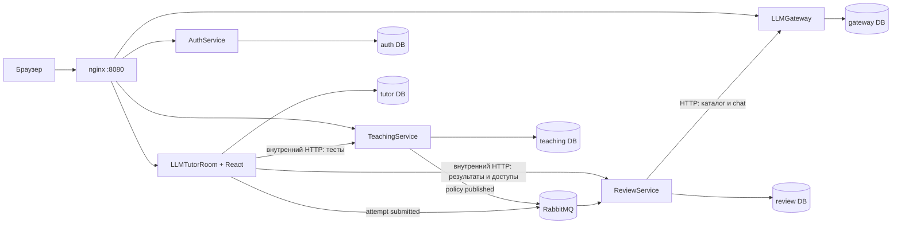
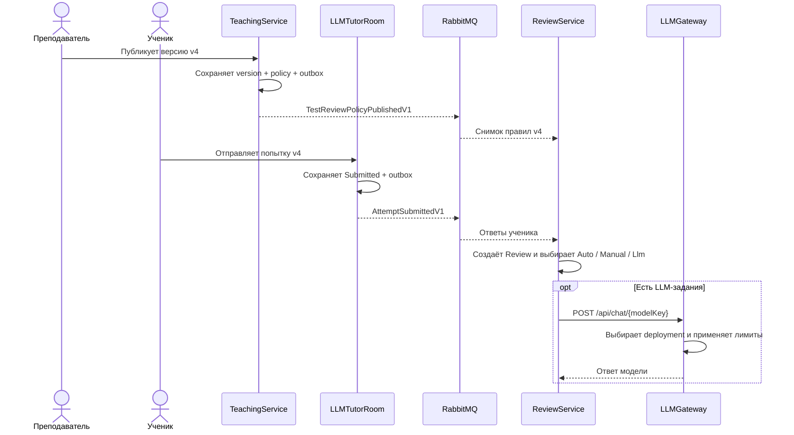

# Архитектура системы

Этот документ даёт общую карту проекта. Детали конкретного сервиса вынесены в
отдельные документы:

- [AuthService](auth-service.md)
- [TeachingService](teaching-service.md)
- [LLMTutorRoom](llm-tutor-room.md)
- [ReviewService](review-service.md)
- [LLMGateway](llm-gateway.md)

## Границы ответственности

Система разделена не по экранам, а по владельцам данных и бизнес-правил.

| Сервис | Чем владеет | Чего не делает |
| --- | --- | --- |
| `AuthService` | Пользователи, роли, пароли и выдача JWT | Не хранит учебные данные |
| `TeachingService` | Тесты, задания, версии тестов и опубликованные правила проверки | Не создаёт проверки и не хранит ответы учеников |
| `LLMTutorRoom` | Попытки учеников, сохранённые ответы, таймер попытки и публичный web-фасад | Не выставляет баллы и не выбирает способ проверки |
| `ReviewService` | Проверки, результаты заданий, ручная проверка, LLM-очередь, доступы и квоты преподавателей | Не хранит редактируемый каталог тестов и не выполняет LLM-запрос напрямую к provider-у |
| `LLMGateway` | Каталог моделей, deployment-ы, лимиты и вызов OpenAI-compatible provider-а | Не знает о тестах, учениках, попытках и баллах |

У каждого сервиса своя база данных. Сейчас они работают в одном экземпляре
PostgreSQL, но используют разные базы и не читают таблицы друг друга.

## Два независимых события

Для создания проверки `ReviewService` нужны два факта:

1. `TestReviewPolicyPublishedV1` — неизменяемые правила конкретной версии теста.
2. `AttemptSubmittedV1` — ответы конкретной отправленной попытки.

Суффикс `V1` обозначает версию схемы сообщения, а не номер версии теста. Если
wire-контракт когда-нибудь изменится несовместимо, для него нужно создать новый
тип и routing key, например `...V2`; поле `Revision` продолжит обозначать версию
конкретного теста.

Они приходят от разных сервисов и могут быть доставлены в любом порядке.
`TeachingService` не запускает проверку: он сообщает только о публикации правил.
Бизнес-триггером является сдача попытки учеником, а жизненным циклом проверки
полностью управляет `ReviewService`.

Если попытка пришла раньше policy, она сохраняется в `PendingSubmissions`.
После получения точной версии policy проверка создаётся автоматически. Новая
версия теста никогда не подменяет правила уже начатой или отправленной попытки.

## Синхронное и асинхронное взаимодействие

Синхронный HTTP используется, когда ответ нужен пользователю прямо сейчас:

- вход и получение текущего пользователя;
- чтение и редактирование тестов;
- старт и сохранение попытки;
- чтение результатов и истории;
- выставление ручного балла;
- управление моделями и доступами.

RabbitMQ используется только для фактов, которые должны пережить временную
недоступность другого сервиса:

- опубликована новая версия правил проверки;
- ученик окончательно отправил попытку;
- внутри `ReviewService` нужно выполнить или повторить LLM-проверку.

`TeachingService` и `LLMTutorRoom` записывают интеграционное событие в outbox в
той же транзакции, что и бизнесовое изменение. Фоновый процесс доставляет outbox
в RabbitMQ. `ReviewService` ведёт inbox по `EventId`, поэтому повторная доставка
не создаёт вторую проверку. Это модель доставки **at least once**: дубль допустим
на транспорте, но не в бизнесовых данных.

Внутренняя очередь `review.processing` устроена иначе: сообщение публикуется
после создания `Review`, а источником истины остаётся база `ReviewService`. Если
публикация или worker падают, maintenance-процесс повторно ставит due-проверку в
очередь по её сохранённому состоянию.

## Версии теста и попытки

Логический тест имеет последовательные версии. Одновременно могут существовать
одна опубликованная версия и один редактируемый черновик. Публикация делает
черновик текущей версией, а предыдущую опубликованную версию — `Superseded`.

Попытка сохраняет номер версии и список допустимых заданий на момент старта.
Поэтому:

- правки будущего черновика не меняют уже начатую работу;
- публикация v5 не отменяет попытку или проверку v4;
- старые незавершённые проверки остаются видимыми;
- завершённая история загружается отдельно и постранично.

## Сеть и доверие

В полном Docker Compose рекомендуемой точкой входа в приложение является nginx
на порту `8080`. Он маршрутизирует только публичные `/api/*` и интерфейс React.
Любой путь `/internal/*` получает `404`.

Development Compose дополнительно публикует на хост прямые порты `AuthService`,
`LLMTutorRoom` и `LLMGateway` для отладки. Это не production security boundary:
особенно важно помнить, что API `LLMGateway` сейчас не имеет собственной
аутентификации. Во внешнем окружении прямые host-порты нужно закрыть и оставить
контролируемый ingress.

`ReviewService` подключён только к закрытой сети `backend` и не публикует порт
на хост. Его internal API не имеет собственного JWT или API key: доверие
обеспечивается сетевой границей. `LLMTutorRoom` проверяет JWT и роль пользователя,
а затем обращается к internal API от имени публичного фасада. При другом способе
развёртывания эту границу нужно сохранить сетевой политикой или добавить
межсервисную аутентификацию.

## Где искать код

- Регистрация зависимостей и запуск каждого сервиса находятся в его `Program.cs`.
- HTTP-граница — в `Controllers/`.
- Бизнесовые сценарии — в `Services/`.
- EF Core-модель и владение данными — в `Data/*DbContext.cs` и `Models/`.
- Общие wire-контракты событий и internal API — в
  [`TeachingService.Contracts`](../TeachingService.Contracts) и
  [`ReviewService.Contracts`](../ReviewService.Contracts).
- Docker-топология — в [`docker-compose.yml`](../docker-compose.yml), публичная
  маршрутизация — в [`infra/nginx`](../infra/nginx).

Для знакомства с кодом удобно сначала прочитать этот документ, затем документ
нужного сервиса и только после этого переходить к указанным в нём точкам входа.
