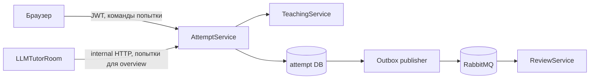
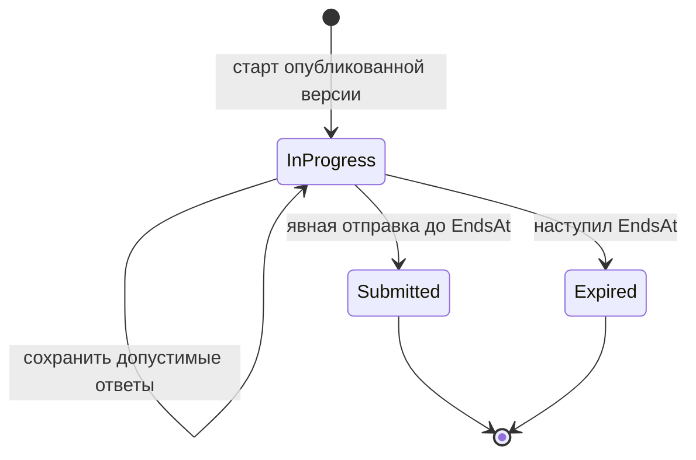
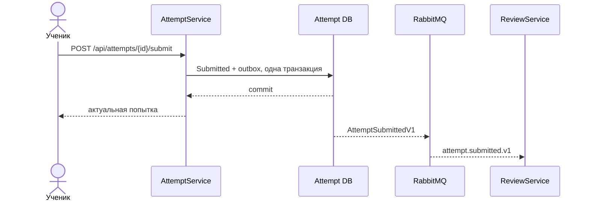

# AttemptService: прохождение тестов

## Назначение и границы владения

`AttemptService` — источник истины для попыток учеников. Он отвечает за старт
попытки, серверный срок, промежуточные ответы, окончательную отправку и надёжную
передачу факта отправки в `ReviewService`.

Сервис не владеет пользователями, тестами или результатами проверки. Идентификатор
ученика приходит из проверенного JWT, опубликованную версию и состав заданий сервис
получает из `TeachingService`, а после отправки `ReviewService` самостоятельно
создаёт и обрабатывает проверку.

## Данные и основные ограничения

В собственной базе `llm_tutor_attempts` находятся две таблицы:

- [`TestAttempts`](../AttemptService/Models/TestAttempt.cs) — выбранная версия
  теста, ученик, статус, серверные времена, ответы и зафиксированный список
  допустимых заданий;
- [`AttemptSubmissionOutboxMessages`](../AttemptService/Models/AttemptSubmissionOutboxMessage.cs)
  — ещё не доставленные или сохранённые на время retention события
  [`AttemptSubmittedV1`](../ReviewService.Contracts/Events/AttemptSubmittedV1.cs).

Пара `TestId + StudentUserId` уникальна: сейчас одному ученику разрешена одна
попытка на логический тест. `TestRevision` и `AllowedTaskIds` фиксируются при
старте, поэтому новая публикация не меняет уже начатую работу и нельзя сохранить
ответ для задания, которого в этой версии не было.

Идентификатор попытки — `Guid`, который создаёт сам `AttemptService`. Поэтому
события остаются глобально различимыми даже после переноса данных между
отдельными базами или повторного развёртывания сервиса.

`StateRevision` используется как optimistic concurrency token. Параллельные
autosave, submit и истечение времени не перезаписывают более новое состояние:
операция перечитывает попытку и либо повторяет безопасное изменение, либо
возвращает конфликт.

## Жизненный цикл

При старте сервис:

1. запрашивает у `TeachingService` опубликованную версию;
2. убеждается, что показанный клиенту `versionNumber` ещё актуален;
3. фиксирует номер версии и видимые task id;
4. рассчитывает `EndsAt` как минимум личного лимита и общего deadline теста;
5. при конкурентном повторном запросе возвращает уже созданную попытку.

Истечение времени и отправка — разные бизнес-события. Фоновый проход переводит
просроченную `InProgress`-попытку в `Expired`, а команды дополнительно проверяют
`EndsAt`, чтобы закрыть гонку с worker-ом. `Expired` запрещает дальнейшее
редактирование, но не создаёт outbox-сообщение и не запускает проверку.

Только явный `submit`, принятый до дедлайна, переводит попытку в `Submitted` и
записывает `AttemptSubmittedV1` в той же транзакции.

## Доставка в ReviewService

Outbox publisher отправляет событие в exchange `review.integration` с routing
key `attempt.submitted.v1` и ждёт publisher confirm. При временной ошибке запись
остаётся в базе и повторяется позже; успешно доставленные записи удаляются
отдельным cleanup-проходом после retention.

Повторный submit не создаёт второе сообщение. Доставка остаётся моделью at least
once, а `ReviewService` подавляет дубли по `EventId` и `AttemptId`.

## HTTP, аутентификация и сеть

Публичная поверхность доступна через nginx:

- `GET /api/attempts` — попытки вошедшего ученика;
- `GET /api/attempts/{attemptId}` — одна принадлежащая ему попытка;
- `POST /api/attempts/tests/{testId}/start?versionNumber=...` — начать попытку;
- `PUT /api/attempts/{attemptId}/answers` — сохранить ответы;
- `POST /api/attempts/{attemptId}/submit` — явно отправить работу.

Эти endpoints проверяют JWT через `Shared.Auth` и требуют роль `Student`.
Идентификатор ученика всегда берётся из `NameIdentifier`, а не из тела или query.
DTO этой границы вынесены в
[`AttemptService.Contracts`](../AttemptService.Contracts/AttemptService.Contracts.csproj),
чтобы фасад использовал тот же wire-контракт без зависимости от реализации
сервиса.

`GET /internal/attempts/students/{studentUserId}` используется только
`LLMTutorRoom` при сборке student overview. nginx возвращает `404` для всех
`/internal/*`; в полном Compose internal endpoint доступен только сервисам в
закрытой сети `backend`.

## Конфигурация, health и запуск

Основные секции [`AttemptService/appsettings.json`](../AttemptService/appsettings.json):

- `ConnectionStrings:DefaultConnection` — собственная PostgreSQL-база;
- `TeachingService` — адрес internal API каталога и timeout;
- `RabbitMq` — соединение с broker-ом;
- `AttemptOutbox` — публикация, retry, retention и cleanup;
- `AttemptExpiration` — период фонового поиска просроченных попыток;
- `AttemptInputLimits` — максимальный размер HTTP-body, количество ответов,
  длина одного ответа и суммарная длина текста;
- `Auth:Jwt` — общие issuer, audience и signing key.

При старте применяются EF Core migrations, затем запускаются
`AttemptExpirationService`, `AttemptSubmissionOutboxPublisherService` и
`AttemptOutboxCleanupService`. `GET /health/live` проверяет процесс, а
`GET /health/ready` — доступность PostgreSQL и, если `RabbitMq:Enabled=true`,
RabbitMQ. В полном Compose сервис
не публикует host-порт и доступен снаружи только через nginx; для локального
запуска используется `http://localhost:5216`.

## С чего начать чтение кода

1. [`Program.cs`](../AttemptService/Program.cs) — DI, JWT, migrations, health и hosted services.
2. [`Controllers`](../AttemptService/Controllers) — публичная и внутренняя HTTP-граница.
3. [`Services`](../AttemptService/Services) — старт, autosave, submit и истечение времени.
4. [`AttemptDbContext`](../AttemptService/Data/AttemptDbContext.cs) и
   [`Models`](../AttemptService/Models) — схема и инварианты хранения.
5. [`IntegrationEvents`](../AttemptService/Services/IntegrationEvents) — outbox и RabbitMQ.
