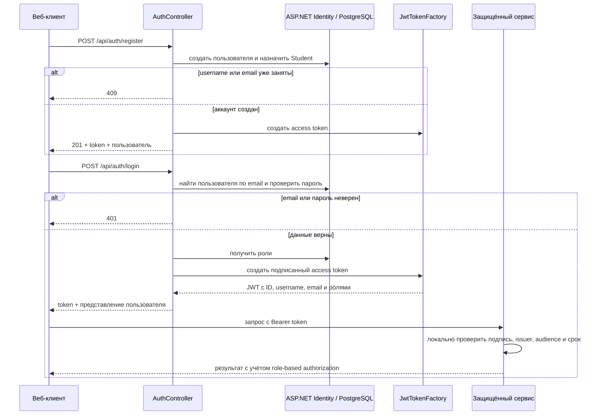

# AuthService: учётные записи и сессии

## Назначение и границы владения

`AuthService` — единственный владелец учётных записей, паролей и ролей пользователей. Он регистрирует студентов, проверяет email и пароль, выпускает JWT и даёт администратору минимальные операции для работы с преподавателями. Идентификатор пользователя из этого сервиса затем используется остальными частями системы как внешний строковый ID.

Сервис не хранит учебные данные, попытки, проверки работ или права преподавателей на LLM-модели. Эти данные принадлежат `TeachingService`, `AttemptService` и `ReviewService`. Здесь также нет обновления профиля, удаления пользователя, refresh token или серверной сессии. После выпуска токен проверяется принимающими сервисами локально через общую библиотеку [`Shared.Auth`](../Shared.Auth/JwtAuthenticationExtensions.cs), без обратного запроса в `AuthService`.

## Ключевые сущности и правила

Пользователь [`ApplicationUser`](../AuthService/Models/ApplicationUser.cs) основан на стандартной модели ASP.NET Core Identity. `UserName` — это отображаемое в интерфейсе имя пользователя, а email — его уникальный идентификатор для входа. Отдельного поля `DisplayName` нет. Пароли, нормализованные username и email, security stamp и связи с ролями остаются в стандартных таблицах Identity. В бизнес-модели предусмотрены роли `Admin`, `Teacher` и `Student` из [`UserRole`](../AuthService/Models/UserRole.cs).

Пароль должен содержать не меньше шести символов; требования к регистру, цифрам и специальным символам отключены. `UserName` обязателен, ограничен 64 символами, не может содержать пробельные символы и должен быть уникальным. Email также обязателен и уникален. Публичная регистрация всегда назначает новой учётной записи роль `Student`; роль из HTTP-запроса не принимается. Преподавателя по-прежнему может создать только `Admin`, а администраторы заводятся через стартовую конфигурацию либо напрямую средствами Identity.

При каждом запуске [`ConfiguredUsersService`](../AuthService/Services/ConfiguredUsersService.cs):

1. создаёт отсутствующие роли из `UserRole`;
2. читает `Auth:Users`;
3. создаёт отсутствующего пользователя либо синхронизирует его `UserName` и email;
4. оставляет ему ровно одну настроенную роль;
5. сбрасывает пароль, если он отличается от указанного в конфигурации.

Удаление записи из `Auth:Users` не удаляет уже созданного пользователя. Запись с
пустым `UserName`, `Email` или `Password` пропускается, а ошибка binding или
Identity при создании, смене роли или пароля прерывает запуск приложения.
Если в записи не задан `Role`, значение enum по умолчанию — `Admin`; такую запись сервис не считает некорректной.

## Основной поток аутентификации

Токен содержит `sub` и `NameIdentifier` с ID пользователя, `preferred_username` и `Name` с `UserName`, email и отдельный role claim для каждой роли. `/api/auth/me` не читает базу: endpoint просто строит ответ из claims уже проверенного токена.

## Зависимости и HTTP-граница

Сервис зависит только от PostgreSQL и общей сборки `Shared.Auth`; исходящих HTTP-вызовов и сообщений RabbitMQ у него нет. Через nginx наружу проксируются две группы маршрутов:

- `POST /api/auth/login` — публичный вход;
- `POST /api/auth/register` — публичная регистрация студента с немедленной выдачей JWT;
- `GET /api/auth/me` — проверка текущего Bearer-токена;
- `GET /api/users/teachers` — список преподавателей для администратора;
- `POST /api/users/teachers` — создание преподавателя администратором.

Фронтенд использует маршруты `/api/auth/*` для регистрации, входа и восстановления сессии, а административные экраны — маршруты преподавателей. `LLMTutorRoom`, `TeachingService`, `AttemptService` и `ReviewService` подключают [`AddJwtAuthentication`](../Shared.Auth/JwtAuthenticationExtensions.cs) и должны иметь те же issuer, audience и signing key.

## Данные и конфигурация

[`AuthDbContext`](../AuthService/Data/AuthDbContext.cs) создаёт стандартные таблицы `AspNetUsers`, `AspNetRoles` и таблицы связей/claims/tokens. Миграции автоматически применяются до старта HTTP-конвейера. Основные настройки находятся в [`appsettings.json`](../AuthService/appsettings.json):

- `ConnectionStrings:DefaultConnection` — PostgreSQL;
- `Auth:Jwt` — issuer, audience, симметричный signing key и срок токена в минутах;
- `Auth:Users` — пользователи, состояние которых синхронизируется при старте.

Signing key обязателен и должен занимать не меньше 32 байт. Значения в репозитории — локальные development credentials; для другого окружения их нужно переопределять секретами или переменными среды.

## Ошибки и важные нюансы

- JWT не отзывается: смена пароля, username, email или роли не меняет уже выпущенный токен. До истечения срока `/me` тоже вернёт старые claims.
- Вход различает `email-not-found` и `invalid-password` в теле ответа, хотя клиент показывает одну общую ошибку. Ограничения частоты попыток и lockout в этом потоке не реализованы.
- Публичная регистрация не подтверждает владение email и не ограничена CAPTCHA/rate limit; перед публичным production-запуском этот слой нужно добавить.
- Ответ пользователя содержит только первую роль, хотя JWT умеет включать несколько. Настроенные и созданные через API пользователи в нормальном сценарии имеют одну роль.
- При дублирующемся username или email создание студента или преподавателя возвращает `409`; ошибки политики Identity превращаются в исключение. Отдельного глобального обработчика ошибок в сервисе нет.
- В PostgreSQL создание пользователя и назначение роли выполняются в одной транзакции; ошибка любого шага не оставляет учётную запись без роли.
- Синхронизация `Auth:Users` делает конфигурацию авторитетной для паролей и ролей bootstrap-пользователей, поэтому случайный production override проявится сразу после перезапуска.
- Signing key симметричный: сервисы, которым передан этот секрет для проверки JWT, технически могут и подписывать токены.

## С чего начать чтение кода

1. [`Program.cs`](../AuthService/Program.cs) — Identity, JWT, миграции и стартовая синхронизация.
2. [`AuthController.cs`](../AuthService/Controllers/AuthController.cs) — регистрация студента, вход и проекция claims в `/me`.
3. [`ConfiguredUsersService.cs`](../AuthService/Services/ConfiguredUsersService.cs) — правила bootstrap-пользователей.
4. [`UsersController.cs`](../AuthService/Controllers/UsersController.cs) и [`UserAccountService.cs`](../AuthService/Services/UserAccountService.cs) — административный сценарий преподавателей.
5. [`JwtTokenFactory.cs`](../Shared.Auth/JwtTokenFactory.cs) и [`JwtAuthenticationExtensions.cs`](../Shared.Auth/JwtAuthenticationExtensions.cs) — состав и проверка токена.
6. [`AuthDbContext.cs`](../AuthService/Data/AuthDbContext.cs) и [initial migration](../AuthService/Migrations/20260823103951_InitialCreate.cs) — фактическая схема хранения.
