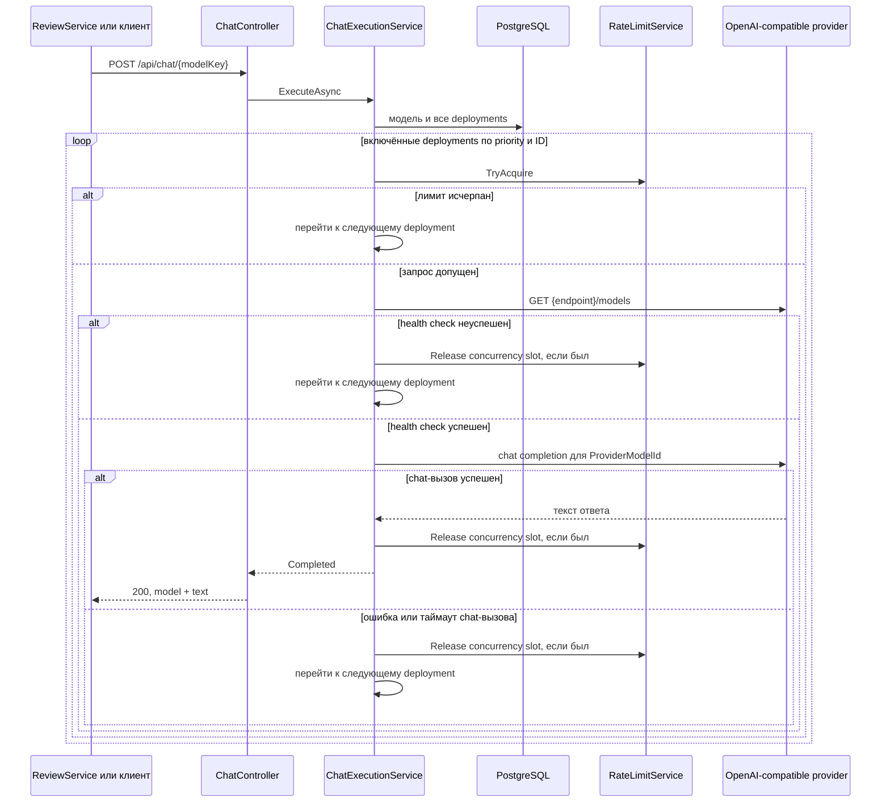

# LLMGateway: маршрутизация запросов к моделям

## Назначение и границы владения

`LLMGateway` скрывает конкретные LLM-провайдеры за единым HTTP-контрактом. Он владеет каталогом логических моделей, их deployment-конфигурациями, API-ключами и техническими ограничениями запросов. Для каждого chat-запроса сервис выбирает доступный deployment, проверяет его и при сбое пробует следующий.

Gateway не решает, какую модель разрешено использовать преподавателю, не резервирует пользовательские квоты и не интерпретирует ответ модели. Ключ сохраняется в [`CourseTestVersion`](../TeachingService/Models/CourseTestVersion.cs); [`ReviewCreationService`](../ReviewService/Services/ReviewCreationService.cs) получает его snapshot, проверяет доступ и резервирует квоту, а [`LlmGatewayReviewClient`](../ReviewService/Services/LlmGatewayReviewClient.cs) формирует prompt и разбирает JSON результата. Gateway также не владеет пользователями, учебными тестами и очередями. В текущем коде у его контроллеров нет аутентификации или role-based authorization.

## Ключевые сущности и правила

[`Model`](../LLMGateway/Data/Models/Model.cs) — логическая модель с уникальным строковым `Key`, названием и описанием. Один ключ объединяет несколько [`ModelDeployment`](../LLMGateway/Data/Models/ModelDeployment.cs). Deployment хранит базовый URL OpenAI-compatible API, необязательный API key, реальный `ProviderModelId`, признак включения, числовой приоритет и необязательный предел параллельных запросов. Меньшее значение `Priority` означает более раннюю попытку; при равенстве используется меньший ID.

[`ModelRateLimitRule`](../LLMGateway/Data/Models/ModelRateLimitRule.cs) задаёт скользящее окно: не больше `MaxRequests` за `WindowSeconds`. У deployment может быть несколько правил, и запрос должен пройти каждое из них. `MaxConcurrentRequests`, равный `null` или `0`, отключает ограничение параллелизма.

Ограничения исполняет singleton [`RateLimitService`](../LLMGateway/Services/RateLimitService.cs). Счётчики находятся только в памяти процесса, защищены общей блокировкой и не сохраняются в PostgreSQL. Правила конфигурации сохраняются, а история запросов и число активных вызовов — нет.

## Основной поток chat-запроса



[`ChatExecutionService`](../LLMGateway/Services/ChatExecutionService.cs) сначала отличает неизвестный ключ (`404`) от модели без включённых deployment (`503`). Перед фактическим вызовом он резервирует лимиты и выполняет `GET /models` с таймаутом три секунды, добавляя Bearer API key, если он задан. Затем [`ChatClientFactory`](../LLMGateway/Services/ChatClientFactory.cs) создаёт OpenAI-compatible клиент, а `ProviderModelId` явно передаётся как model ID. Пустой API key заменяется техническим значением `openai-compatible`.

Если попытка неуспешна, перебор продолжается. Когда исчерпаны все deployment, итоговый статус выбирается с приоритетом: ошибка provider (`502`), таймаут chat-вызова (`504`), недоступность health check (`503`), rate limit (`429`), concurrency limit (`429`).

## Зависимости и HTTP-граница

Основной потребитель — [`ReviewService`](../ReviewService/Services/LlmGatewayReviewClient.cs): он вызывает `/api/chat/{modelKey}` для свободных ответов и [`/api/models/catalog`](../ReviewService/Services/LlmGatewayModelCatalogClient.cs) для каталога. Nginx публикует маршруты gateway под префиксом `/api/llm/*`, удаляя сегмент `llm`; внутри compose `ReviewService` обращается напрямую к `http://llm-gateway:8080`.

HTTP-интерфейс делится на две части:

- `/api/chat/{modelKey}` принимает непустой список сообщений с ролями `system`, `user` или `assistant` и необязательную temperature от 0 до 2;
- `/api/models` управляет моделями, deployments и rate-limit rules; `/api/models/catalog` возвращает полный каталог, а `GET /api/models` — только ключи с хотя бы одним включённым deployment.

Исходящие зависимости — PostgreSQL и настроенные OpenAI-compatible HTTP API. RabbitMQ и другие backend-сервисы gateway не вызывает.

## Минимальная настройка модели

В Development каталог можно подготовить через Swagger либо двумя запросами к
прямому порту gateway. Сначала создаётся логический ключ:

```http
POST http://localhost:5200/api/models
Content-Type: application/json

{
  "key": "gemma3:12b",
  "displayName": "Gemma 3 12B",
  "description": "Локальная модель для проверки ответов"
}
```

Затем к нему добавляется хотя бы один включённый deployment:

```http
POST http://localhost:5200/api/models/gemma3:12b/deployments
Content-Type: application/json

{
  "endpoint": "http://host.docker.internal:11434/v1",
  "providerModelId": "gemma3:12b",
  "isEnabled": true,
  "priority": 0,
  "maxConcurrentRequests": 1
}
```

`endpoint` должен быть доступен именно из окружения `LLMGateway`. После этого
администратор отдельно выдаёт преподавателю доступ и квоту в интерфейсе — это
уже данные `ReviewService`, а не gateway.

Если на host-машине запущен `CodexHost`, к отдельной логической модели с key
`luna` добавляется обычный HTTP deployment:

```http
POST http://localhost:5200/api/models/luna/deployments
Content-Type: application/json

{
  "endpoint": "http://host.docker.internal:5250/v1",
  "apiKey": "local-codex-secret",
  "providerModelId": "gpt-5.6-luna",
  "isEnabled": true,
  "priority": 0,
  "maxConcurrentRequests": 1
}
```

## Данные и конфигурация

[`AppDbContext`](../LLMGateway/Data/AppDbContext.cs) хранит `Models` и связанные с ними `ModelDeployments`; удаление модели каскадно удаляет deployments. Массив rate-limit rules сериализуется в одну колонку PostgreSQL `jsonb` с EF value comparer. API key сохраняется обычной строкой без прикладного шифрования, но намеренно отсутствует в response DTO. Миграция применяется автоматически при запуске для relational database.

В [`appsettings.json`](../LLMGateway/appsettings.json) обязательна фактически только `ConnectionStrings:DefaultConnection`; provider endpoints и ключи создаются через model API, а не через конфигурацию. Настройки Codex находятся в отдельном `CodexHost` и в контейнер gateway не передаются. Таймаут health check зафиксирован в коде. Swagger доступен только в Development.

## Ошибки и важные нюансы

- Лимиты локальны одному процессу, сбрасываются при рестарте и не дают глобального ограничения при нескольких репликах.
- Rate-limit timestamp записывается до health check. Недоступный или упавший provider всё равно расходует запрос в скользящем окне; только concurrency slot освобождается в `finally`.
- Health-check timeout классифицируется как `ProviderUnavailable`; ошибка chat-вызова обнаруживается после него и допускает failover.
- ID правила вычисляется как текущий глобальный максимум в JSON-массивах плюс один. Параллельное создание правил не защищено транзакционной последовательностью и может породить одинаковые ID.
- API управления каталогом и chat endpoint не защищены. Если ограничение доступа требуется, его нужно обеспечить внешней сетевой политикой; текущий compose публикует и nginx-маршрут, и прямой порт `5200` на host.
- Необработанные ошибки превращаются глобальным handler в обезличенный `500`; отмена исходного HTTP-запроса пробрасывается из execution service.

## С чего начать чтение кода

1. [`Program.cs`](../LLMGateway/Program.cs) — DI, PostgreSQL, миграции и обработка ошибок.
2. [`ChatController.cs`](../LLMGateway/Controllers/ChatController.cs) — внешние статусы chat-вызова.
3. [`ChatExecutionService.cs`](../LLMGateway/Services/ChatExecutionService.cs) — выбор deployment, health check и failover.
4. [`RateLimitService.cs`](../LLMGateway/Services/RateLimitService.cs) — семантика окон и параллелизма.
5. [`ModelsController.cs`](../LLMGateway/Controllers/ModelsController.cs) — изменение каталога и правила генерации ID.
6. [`AppDbContext.cs`](../LLMGateway/Data/AppDbContext.cs) и [initial migration](../LLMGateway/Migrations/20260807135241_InitialCreate.cs) — хранение сущностей и JSONB.
7. [`ChatExecutionServiceTests.cs`](../LLMGateway.Tests/ChatExecutionServiceTests.cs) — зафиксированные сценарии failover.
