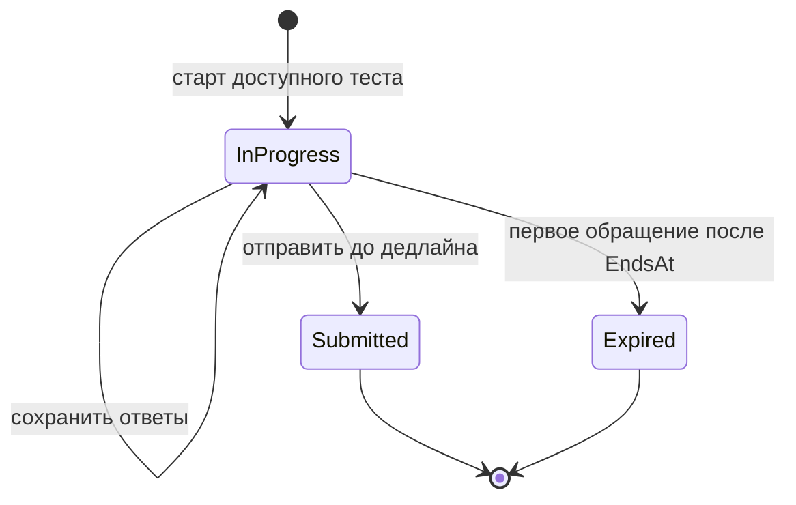
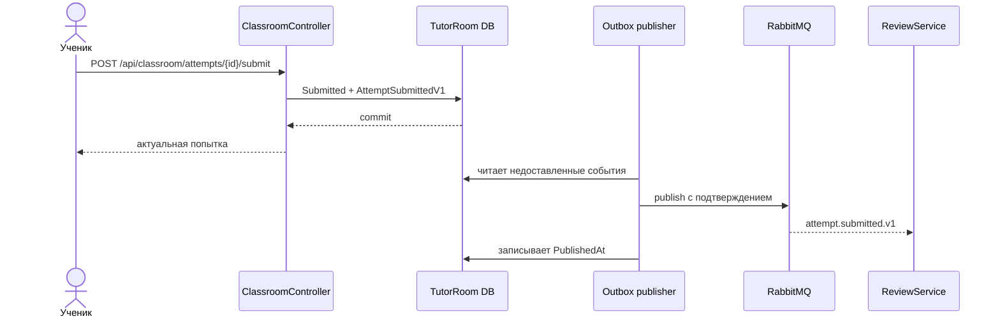

# LLMTutorRoom

## Назначение

`LLMTutorRoom` — публичный фасад учебной части системы и хост React-приложения.
Он объединяет данные других сервисов в удобный для интерфейса overview, но сам
владеет только попытками учеников и сохранёнными ответами.

Сервис отвечает за:

- старт попытки и серверный дедлайн;
- промежуточное сохранение ответов;
- окончательную отправку попытки;
- привязку попытки к точной версии теста;
- выдачу общего экрана преподавателя или ученика;
- проксирование результатов, ручной проверки и управления доступами к моделям;
- раздачу собранного React-приложения.

Каталог тестов принадлежит `TeachingService`, пользователи — `AuthService`, а
результаты — `ReviewService`. `LLMTutorRoom` не должен копировать их бизнесовую
логику в свою базу.

## Данные сервиса

В [`TutorRoomDbContext`](../LLMTutorRoom/Data/TutorRoomDbContext.cs) находятся
две основные таблицы:

- `TestAttempts` — состояние попытки, версия теста, время начала и окончания,
  ответы и список допустимых заданий;
- `AttemptSubmissionOutboxMessages` — события о сданных попытках, которые ещё
  нужно доставить в RabbitMQ или сохранить на время retention.

Пара `(TestId, StudentUserId)` уникальна. Поэтому у ученика сейчас одна попытка
на логический тест, а публикация новой версии не выдаёт автоматическую пересдачу.

`TestRevision` хранит номер опубликованной версии, выбранной при старте.
`AllowedTaskIds` фиксирует состав этой версии и не позволяет записать ответ для
задания, которого в попытке не было.

## Жизненный цикл попытки

При старте [`ClassroomService`](../LLMTutorRoom/Services/ClassroomService.cs):

1. Запрашивает у `TeachingService` текущую опубликованную версию.
2. Проверяет переданный клиентом `versionNumber`, статус и дедлайн.
3. Сохраняет номер версии, допустимые task id и `EndsAt` — минимум из личного
   лимита времени и общего дедлайна теста.
4. При параллельных запросах возвращает уже созданную попытку, а не создаёт две.

Сохранение ответов и отправка защищены `StateRevision` — optimistic concurrency
token EF Core. Если две вкладки одновременно меняют попытку, операция перечитывает
актуальное состояние и повторяется. Это не даёт позднему autosave вернуть
`Submitted`-попытку в работу или отправить устаревший снимок ответов.

`Expired` означает, что время вышло и ответы больше нельзя менять. Переход
фиксируется лениво при следующем overview, старте, сохранении или отправке, а не
отдельным таймером ровно в `EndsAt`. Такая попытка не публикуется как сданная и
не создаёт проверку.

## Отправка попытки

Статус `Submitted` и `AttemptSubmittedV1` записываются одной транзакцией. Фоновый
[`AttemptSubmissionOutboxPublisher`](../LLMTutorRoom/Services/ReviewIntegration/AttemptSubmissionOutboxPublisher.cs)
доставляет событие в exchange `review.integration` с routing key
`attempt.submitted.v1`.

Событие содержит идентификаторы попытки, теста и версии, ученика, окончательный
словарь ответов и время отправки. Оно сообщает факт сдачи, но не задаёт способ
проверки. Решение между `Auto`, `Manual` и `Llm` принимает `ReviewService` по
опубликованной policy.

## Overview и версии

`GET /api/classroom/overview` формирует разные ответы по роли:

- преподавателю возвращаются его тесты, доступные модели, незавершённые проверки,
  первая страница завершённых результатов и агрегированные метрики;
- ученику — опубликованные тесты, его попытки, проверки и результаты.

Если у ученика есть попытка старой версии, сервис запрашивает именно эту версию
у `TeachingService` и подставляет её вместо текущей. Правильные варианты ответов
при этом удаляются из student DTO. Если точную версию получить нельзя, сервис не
показывает задания новой версии под видом старых.

Завершённая история читается через `GET /api/classroom/reviews/history` страницами.
Курсор непрозрачен для клиента; его нужно передавать обратно без разбора.

## Публичный API и зависимости

HTTP-граница находится в
[`ClassroomController`](../LLMTutorRoom/Controllers/ClassroomController.cs) и
[`ModelAccessController`](../LLMTutorRoom/Controllers/ModelAccessController.cs).
Оба контроллера требуют JWT, а операции старта/ответов/отправки, ручной проверки
и администрирования дополнительно ограничены ролями.

Синхронные зависимости:

- [`TeachingServiceClient`](../LLMTutorRoom/Services/Teaching/TeachingServiceClient.cs)
  читает внутренний каталог и точные версии;
- [`ReviewServiceClient`](../LLMTutorRoom/Services/Reviews/ReviewServiceClient.cs)
  читает проверки, обновляет ручной результат и управляет доступами к моделям.

Недоступность этих сервисов может сделать overview временно недоступным, но не
нарушает уже сохранённую попытку или outbox.

## React-приложение

Клиент находится в [`LLMTutorRoom/ClientApp`](../LLMTutorRoom/ClientApp). После
сборки Vite его файлы попадают в `wwwroot`, а ASP.NET Core отдаёт `index.html`
для client-side routes.

Основные разделы:

- `/admin/teachers` и `/admin/model-access`;
- `/teacher/dashboard`, `/teacher/tests`, `/teacher/reviews`, `/teacher/models`;
- `/student/tests` и `/student/results`.

[`App.jsx`](../LLMTutorRoom/ClientApp/src/app/App.jsx) выбирает раздел по роли.
Во время попытки клиент сохраняет ответы, восстанавливает таймер после перезагрузки
и блокирует уход со страницы, пока не завершена обязательная запись.

## Конфигурация и запуск

Основные секции [`appsettings.json`](../LLMTutorRoom/appsettings.json):

- `ConnectionStrings` — база попыток;
- `TeachingService` и `ReviewService` — адреса внутренних API и timeout;
- `RabbitMq` — соединение с broker-ом;
- `AttemptSubmissionOutbox` — частота публикации, retry и очистка доставленных
  сообщений;
- `Auth:Jwt` — проверка токенов, общая с `AuthService`.

При старте применяются EF Core migrations, запускаются publisher и cleanup
outbox, затем ASP.NET Core обслуживает API и React.

## С чего начать чтение

1. [`Program.cs`](../LLMTutorRoom/Program.cs) — DI, middleware и hosted services.
2. [`ClassroomService.cs`](../LLMTutorRoom/Services/ClassroomService.cs) — весь
   жизненный цикл попытки и сборка overview.
3. [`ClassroomModels.cs`](../LLMTutorRoom/Models/ClassroomModels.cs) — данные
   попытки и ответ фасада.
4. [`AttemptSubmissionOutboxPublisher.cs`](../LLMTutorRoom/Services/ReviewIntegration/AttemptSubmissionOutboxPublisher.cs)
   — граница асинхронной передачи в `ReviewService`.
5. [`ClientApp/src/app/App.jsx`](../LLMTutorRoom/ClientApp/src/app/App.jsx) —
   ролевая маршрутизация frontend-а.
