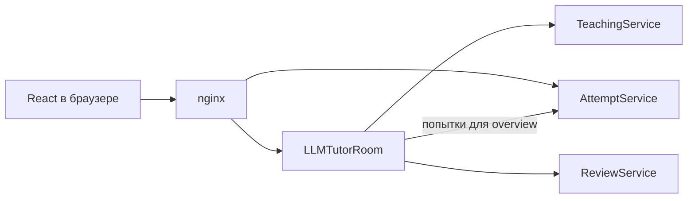

# LLMTutorRoom: web-фасад и React-приложение

## Назначение

`LLMTutorRoom` — stateless web-фасад учебной части системы и хост
React-приложения. Он проверяет JWT, объединяет ответы профильных сервисов в
удобный для интерфейса overview и проксирует команды, которым нужен единый
публичный API.

Собственной бизнесовой базы у сервиса нет. Пользователи принадлежат
`AuthService`, каталог и версии тестов — `TeachingService`, попытки и ответы —
`AttemptService`, результаты и доступы к моделям — `ReviewService`.

## Overview

`GET /api/classroom/overview` формирует разные ответы по роли:

- преподавателю возвращаются его тесты, доступные модели, незавершённые
  проверки, первая страница истории и агрегированные метрики;
- ученику — опубликованные тесты, его попытки, проверки и результаты.

Для student overview фасад получает попытки из internal API `AttemptService`.
Если попытка привязана к предыдущей версии, `LLMTutorRoom` запрашивает именно
эту версию у `TeachingService` и не подставляет задания новой публикации.
Правильные ответы перед возвратом ученику удаляются из DTO.

Завершённая история читается через
`GET /api/classroom/reviews/history` страницами. Курсор непрозрачен для клиента
и передаётся в `ReviewService` без разбора.

## Публичный API и зависимости

HTTP-граница фасада находится в
[`ClassroomController`](../LLMTutorRoom/Controllers/ClassroomController.cs) и
[`ModelAccessController`](../LLMTutorRoom/Controllers/ModelAccessController.cs).
Она требует JWT, а ручная проверка и управление доступами дополнительно
ограничены ролями.

Синхронные клиенты:

- [`TeachingServiceClient`](../LLMTutorRoom/Services/Teaching/TeachingServiceClient.cs)
  читает каталог и точные версии тестов;
- [`AttemptServiceClient`](../LLMTutorRoom/Services/Attempts/AttemptServiceClient.cs)
  читает попытки ученика для overview;
- [`ReviewServiceClient`](../LLMTutorRoom/Services/Reviews/ReviewServiceClient.cs)
  читает результаты, обновляет ручную проверку и управляет доступами к моделям.

Команды жизненного цикла попытки идут от браузера на `/api/attempts/*`, а nginx
направляет запрос напрямую в
`AttemptService`, который сам проверяет JWT и роль ученика.

Internal API `AttemptService` и `ReviewService` не публикуются через nginx.
Фасад передаёт им уже проверенный user ID, а доверие между сервисами в полном
Compose обеспечивается закрытой сетью `backend`.

## React-приложение

Клиент находится в [`LLMTutorRoom/ClientApp`](../LLMTutorRoom/ClientApp). После
сборки Vite его файлы попадают в `wwwroot`, а ASP.NET Core отдаёт `index.html`
для client-side routes.

Основные разделы:

- `/admin/teachers` и `/admin/model-access`;
- `/teacher/dashboard`, `/teacher/tests`, `/teacher/reviews`, `/teacher/models`;
- `/student/tests` и `/student/results`.

Во время попытки клиент сохраняет ответы напрямую в `AttemptService`,
восстанавливает серверный таймер после перезагрузки и блокирует уход со страницы,
пока обязательная запись не завершена.

## Конфигурация и запуск

Основные секции [`LLMTutorRoom/appsettings.json`](../LLMTutorRoom/appsettings.json):

- `TeachingService`, `AttemptService` и `ReviewService` — адреса internal API и
  timeout;
- `Auth:Jwt` — общие параметры проверки токенов.

Сервис не использует EF Core migrations, PostgreSQL, RabbitMQ или фоновые
процессы outbox. Недоступность одного из downstream-сервисов может
сделать соответствующую часть overview временно недоступной, но не изменяет
сохранённые бизнесовые данные.

## С чего начать чтение кода

1. [`Program.cs`](../LLMTutorRoom/Program.cs) — DI, HTTP clients, JWT и раздача
   React.
2. [`Controllers`](../LLMTutorRoom/Controllers) — публичная BFF-граница.
3. [`ClassroomService`](../LLMTutorRoom/Services/ClassroomService.cs) — сборка overview.
4. [`AttemptServiceClient`](../LLMTutorRoom/Services/Attempts/AttemptServiceClient.cs)
   — чтение попыток.
5. [`App.jsx`](../LLMTutorRoom/ClientApp/src/app/App.jsx) — ролевая маршрутизация
   frontend-а.
