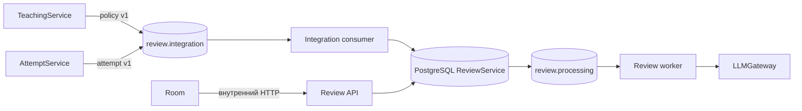
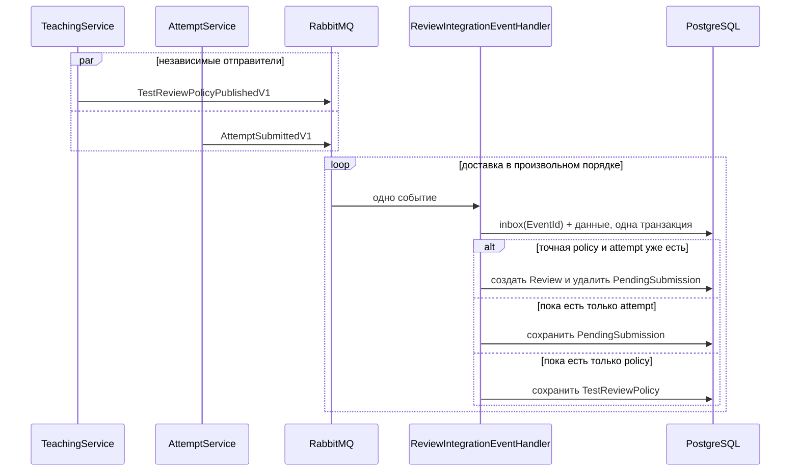
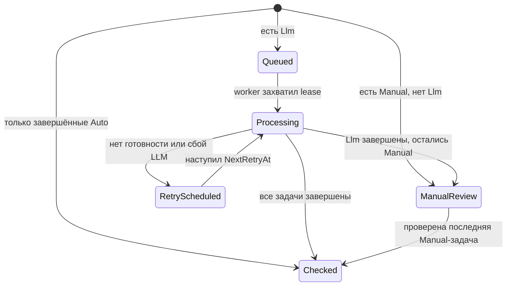

# ReviewService: проверки, результаты и LLM-квоты

## Назначение и границы владения

`ReviewService` — источник истины для проверки отправленных работ. Он хранит
неизменяемые снимки правил конкретных версий теста, проверки и результаты по
заданиям, права преподавателей на LLM-модели, расход квот, inbox и временно
несопоставленные отправки. Схема описана в
[`ReviewDbContext`](../ReviewService/Data/ReviewDbContext.cs), а публичные между
сервисами типы — в
[`ReviewService.Contracts`](../ReviewService.Contracts/ReviewService.Contracts.csproj).

Сервис не владеет пользователями, каталогом тестов, жизненным циклом попытки или
deployment моделей. Пользователи принадлежат `AuthService`, версии тестов —
`TeachingService`, попытки и ответы до отправки — `AttemptService`, каталог и вызов
провайдера — `LLMGateway`. `ReviewService` получает только достаточные снимки и
после этого самостоятельно ведёт результат, не перечитывая изменившийся тест.

## Два входящих события и независимый порядок

Маршруты direct exchange заданы в
[`ReviewIntegrationRoutes`](../ReviewService.Contracts/Messaging/ReviewIntegrationRoutes.cs).
[`TestReviewPolicyPublishedV1`](../ReviewService.Contracts/Events/TestReviewPolicyPublishedV1.cs)
несёт `TestId + Revision`, владельца, заголовок, снимок `ModelKey` и видимые
задания с критериями и вариантами ответа.
[`AttemptSubmittedV1`](../ReviewService.Contracts/Events/AttemptSubmittedV1.cs)
несёт точную `TestRevision`, ученика, ответы и время отправки. Проверка создаётся
только для точной пары теста и ревизии: более новая policy не подменяет старую.
Это событие публикуется только после явной отправки в `AttemptService`.
Фоновый переход попытки в `Expired` сообщения не создаёт, поэтому сам по себе
дедлайн не запускает проверку.

Порядок событий не гарантируется. Если policy уже сохранена, событие попытки
сразу создаёт `Review`. Если попытка пришла первой, она попадает в
[`PendingSubmission`](../ReviewService/Models/Reviews/PendingSubmission.cs); при
получении policy обработчик выбирает все ожидающие попытки этой ревизии, создаёт
проверки и удаляет временные записи. Policy, пришедшая первой, просто ждёт
будущую попытку.

[`ReviewIntegrationConsumer`](../ReviewService/Messaging/IntegrationEvents/ReviewIntegrationConsumer.cs)
валидирует routing key и JSON. Невалидное сообщение сразу уходит в integration
DLQ; временная ошибка повторяется через retry queue с фиксированной задержкой и
после `IntegrationMaxRetryAttempts` тоже попадает в DLQ. Обработчик
[`ReviewIntegrationEventHandler`](../ReviewService/Services/ReviewIntegrationEventHandler.cs)
пишет [`InboxMessage`](../ReviewService/Models/Reviews/InboxMessage.cs) с уникальным
`EventId` в одной serializable-транзакции с бизнес-изменениями. Дополнительно
уникальный `AttemptId` не позволяет создать две проверки из разных событий об
одной попытке. Это идемпотентные эффекты поверх доставки как минимум один раз,
а не обещание exactly-once.

## Auto, Manual и Llm

Режимы определены в
[`ReviewCheckMode`](../ReviewService.Contracts/Enums/ReviewCheckMode.cs), начальный
результат строит
[`ReviewScoringService`](../ReviewService/Services/ReviewScoringService.cs).

- `Auto` завершает задание при создании проверки. `SingleChoice` требует точного
  совпадения, `MultipleChoice` начисляет доли балла и вычитает штраф за лишние
  варианты, а `FreeText` использует простую эвристику длины ответа. Балл
  округляется до десятых и ограничивается диапазоном `0..MaxScore`.
- `Manual` создаёт задачу в `ManualReview`. Изменить её может только владелец
  проверки; проверяются состояние и диапазон балла, затем пересчитываются общий
  балл и summary. Реализация —
  [`ReviewQueryService`](../ReviewService/Services/ReviewQueryService.cs).
- `Llm` создаёт `Pending` и отправляет всю проверку в собственную processing
  queue. [`LlmGatewayReviewClient`](../ReviewService/Services/LlmGatewayReviewClient.cs)
  вызывает `/api/chat/{modelKey}`, требует JSON с `score`, `feedback`,
  `findings`, а scoring нормализует ответ.

## Собственная очередь и состояния

Integration queue принимает факты других сервисов; `review.processing` — другая
топология, принадлежащая только `ReviewService`. После commit создание work
message не атомарно с БД, поэтому
[`ReviewQueueMaintenanceService`](../ReviewService/Messaging/ReviewProcessing/ReviewQueueMaintenanceService.cs)
повторно публикует `Queued` и due `RetryScheduled`, а также возвращает в retry
проверки с истёкшей processing lease. `ProcessingGeneration` — concurrency token,
который не даёт устаревшему worker сохранить результат поверх нового владельца.

[`ReviewJobProcessor`](../ReviewService/Services/ReviewJobProcessor.cs) при любой
ошибке LLM, timeout, отключённом gateway, отсутствующем доступе или исчерпанной
квоте оставляет LLM-задачу в `RetryScheduled`. Задержки берутся из
`RetryDelaysSeconds`; после исчерпания списка последняя задержка применяется без
ограничения числа попыток. Автоматического перевода в ручную проверку **нет**.
Malformed или несовместимое work message попадает в processing DLQ; потерянную
публикацию и сбой worker восстанавливает состояние в БД и maintenance pass.

[`ReviewStatus`](../ReviewService.Contracts/Enums/ReviewStatus.cs) также содержит
`PendingPolicy` и `Failed`. Текущий штатный поток
`PendingPolicy` не выставляет — ожидание policy представлено отдельной
`PendingSubmission`; `Failed` считается terminal при чтении, но обычный
процессор LLM переводит ошибки в retry, а не в `Failed`. У задач основной путь —
`Pending → Processing → Succeeded/RetryScheduled` или
`ManualReview → Succeeded`; `ReviewTaskStatus.Failed` текущие обработчики также
не выставляют.

## Доступ к моделям и квота

[`TeacherModelAccessService`](../ReviewService/Services/TeacherModelAccessService.cs)
при выдаче и чтении grant сверяет ключ с живым каталогом `LLMGateway`, но сам
хранит настройки преподавателя: `IsEnabled`, `PeriodSeconds`, `MaxChecks`.
Usage учитывается по выровненным к Unix epoch периодам для пары
преподаватель–модель. Перед LLM-вызовами сервис одной
serializable-транзакцией списывает число LLM-заданий и ставит на `Review`
`LlmQuotaReservedAt`, поэтому повторный worker не списывает квоту второй раз.
Ответ API показывает deployment availability, использованный и оставшийся лимит
и границы текущего периода. Отсутствующий grant, нулевой лимит или нехватка
остатка не создают manual fallback — проверка ждёт следующей попытки retry.

## Хранение, результаты и пагинация

Основные таблицы: [`Review`](../ReviewService/Models/Reviews/Review.cs) и дочерние
[`ReviewTask`](../ReviewService/Models/Reviews/ReviewTask.cs), versioned policy,
pending submissions, inbox, model access и usage. В результате сохраняются
снимки названия теста, модели, prompt, ответа ученика и вариантов;
[`ReviewResponse`](../ReviewService.Contracts/Responses/ReviewResponse.cs)
возвращает времена обработки, число попыток, ошибки, баллы, feedback и до пяти
findings.

Read API отделяет все non-terminal проверки от terminal (`Checked`, `Failed`).
Пагинация применяется только к terminal-части: keyset по `SubmittedAt + Id`,
по умолчанию 25 и максимум 100 записей; `nextCursor` непрозрачен и должен
передаваться без разбора. Для преподавателя обычная выдача terminal ограничена
последней известной ревизией каждого теста, а `/history` может включить прежние
версии. У ученика история охватывает все ревизии. Overview-выдача также считает
число non-terminal и средний процент завершённых работ. Реализация и граничные
сценарии зафиксированы в
[`ReviewPaginationTests`](../ReviewService.Tests/ReviewPaginationTests.cs).

Cleanup удаляет только старый inbox по retention. `PendingSubmission` намеренно
не удаляется: после `PendingSubmissionWarningHours` сервис пишет ошибку оператору
и ожидает восстановления точной policy из integration DLQ.

## Internal API, сеть, health и конфигурация

[`ReviewsController`](../ReviewService/Controllers/ReviewsController.cs) даёт
внутренние teacher/student overview и history endpoints, а также ручное
оценивание. [`ModelAccessController`](../ReviewService/Controllers/ModelAccessController.cs)
даёт catalog и GET/PUT/DELETE grant преподавателя. Конкретная HTTP-поверхность:

- `GET /internal/reviews/teachers/{teacherUserId}` и
  `GET /internal/reviews/students/{studentUserId}`, плюс соответствующий
  `/history` с `pageSize`, `cursor`, а для преподавателя —
  `includeHistoricalVersions`;
- `PUT /internal/reviews/{reviewId}/tasks/{taskId}/manual?teacherUserId=...`;
- `GET /internal/model-access/catalog`, GET grant-ов преподавателя и PUT/DELETE
  `/internal/model-access/teachers/{teacherUserId}/models/{modelKey}`.

В самом сервисе нет JWT и
`[Authorize]`: `teacherUserId` считается уже проверенным доверенным фасадом
`LLMTutorRoom`. Поэтому `/internal/*` — именно сетевая граница безопасности.
В [`docker-compose.yml`](../docker-compose.yml) порт только `expose`-нут во
внутреннюю backend-сеть, а
[`nginx.compose.conf`](../infra/nginx/nginx.compose.conf) явно возвращает `404`
для `/internal/*`.

[`Program.cs`](../ReviewService/Program.cs) применяет миграции при старте и
валидирует три секции [`appsettings.json`](../ReviewService/appsettings.json):
`RabbitMq` описывает обе topology, retries, DLQ и prefetch; `ReviewProcessing` —
URL/timeout gateway, lease, maintenance и enqueue throttle; `ReviewStorage` —
retention inbox, batch cleanup и порог предупреждения pending. `/health/live`
проверяет только работающий процесс, `/health/ready` — PostgreSQL и RabbitMQ
(при `RabbitMq:Enabled=false` broker считается здоровым). OpenAPI доступен только
в Development, а upstream HTTP-сбои внутренних API преобразуются в `503`.

## С чего начать чтение кода

1. [`ReviewIntegrationEventHandler`](../ReviewService/Services/ReviewIntegrationEventHandler.cs) — сопоставление событий и идемпотентность.
2. [`ReviewCreationService`](../ReviewService/Services/ReviewCreationService.cs) — создание результата и резерв квоты.
3. [`ReviewJobProcessor`](../ReviewService/Services/ReviewJobProcessor.cs) — lease, LLM и retry-состояния.
4. [`RabbitMqTopology`](../ReviewService/Messaging/RabbitMqTopology.cs) — integration/work queues и обе DLQ.
5. [`ReviewQueryService`](../ReviewService/Services/ReviewQueryService.cs) — ручная проверка, результаты и cursor pagination.
6. [`ReviewPipelineTests`](../ReviewService.Tests/ReviewPipelineTests.cs) и [`ReviewJobProcessorTests`](../ReviewService.Tests/ReviewJobProcessorTests.cs) — исполняемые примеры порядка событий, квот и retry без fallback.
