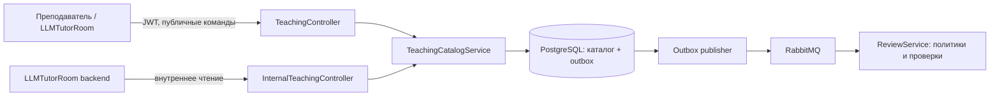
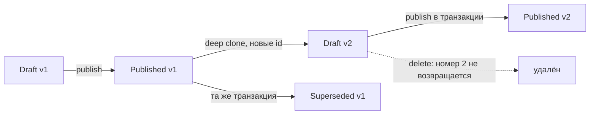

# TeachingService: каталог и версии тестов

## Назначение и границы владения

`TeachingService` — источник истины для преподавательского каталога: логических
тестов, их версий, заданий, вариантов ответа и настроек способа проверки. Владение
зафиксировано в моделях [`CourseTest`](../TeachingService/Models/CourseTest.cs),
[`CourseTestVersion`](../TeachingService/Models/CourseTestVersion.cs) и
[`TestTask`](../TeachingService/Models/TestTask.cs). `TeacherUserId` берётся из JWT,
но сам пользователь принадлежит `AuthService`; внешнего ключа на auth-базу нет.

Сервис не хранит попытки и ответы учеников — это зона `LLMTutorRoom` — и не
создаёт результаты, не расходует квоты и не вызывает LLM: этим владеет
`ReviewService`. Межсервисные DTO и enum каталога находятся в
[`TeachingService.Contracts`](../TeachingService.Contracts/TeachingService.Contracts.csproj),
а событие передачи политики — в
[`ReviewService.Contracts`](../ReviewService.Contracts/Events/TestReviewPolicyPublishedV1.cs).

Публичный контроллер требует роль `Teacher`; внутренний контроллер прикладной
аутентификации не имеет и должен оставаться доступным только в доверенной сети.

## Логический тест и неизменяемые версии

[`CourseTest`](../TeachingService/Models/CourseTest.cs) — стабильная логическая
идентичность с владельцем и монотонным `NextVersionNumber`. Содержимое находится
в дочерних `CourseTestVersion`. Статусы объявлены в
[`CourseTestStatus`](../TeachingService.Contracts/Enums/CourseTestStatus.cs):

- `Draft` — единственная редактируемая версия;
- `Published` — текущая версия для новых попыток;
- `Superseded` — ранее опубликованная неизменяемая история.

Ограничение по `VersionSlot` в
[`TeachingDbContext`](../TeachingService/Data/TeachingDbContext.cs) допускает у
теста не более одного черновика и одной текущей публикации. Для `Superseded` в
колонке хранится `NULL`, поэтому исторических версий может быть много. Пара
`CourseTestId + VersionNumber` уникальна. Удалённый номер черновика не
переиспользуется.

Создание всегда даёт `Draft v1`; передать иной статус нельзя. Новый черновик
создаётся только из текущей опубликованной версии, если другого черновика нет.
Клиент передаёт ожидаемый номер публикации, чтобы не клонировать устаревший
источник. Клонирование копирует метаданные, задания и варианты, но создаёт новые
идентификаторы: попытка всегда привязана к точной версии и её набору заданий.

Менять метаданные, добавлять, заменять, скрывать и удалять задания можно только в
`Draft`. Каждая такая операция сверяет `VersionNumber` и `ContentRevision`, затем
увеличивает ревизию. Удалять разрешено только черновик; если это единственная
версия, удаляется и логический тест.

Публикация проверяет будущий дедлайн, наличие хотя бы одного видимого задания,
поддерживаемые enum и наличие `LlmModelKey`, если видимое задание использует LLM.
Предыдущий `Published` становится `Superseded`, черновик — `Published`; обе записи,
снимок политики и outbox-сообщение сохраняются одной транзакцией. Обычное
редактирование или сохранение черновика событий не создаёт. Основная реализация
сценариев находится в
[`TeachingCatalogService`](../TeachingService/Services/TeachingCatalogService.cs).

## Задания и способы проверки

Типы из [`TestTaskType`](../TeachingService.Contracts/Enums/TestTaskType.cs) —
`SingleChoice`, `MultipleChoice`, `FreeText`. Для вариантов выбора нужны минимум
два непустых ответа; у одиночного выбора ровно один правильный, у множественного
— хотя бы один. Штраф за неверный вариант применяется только к множественному
выбору.

Режимы [`TestTaskCheckMode`](../TeachingService.Contracts/Enums/TestTaskCheckMode.cs):
`Auto`, `Llm`, `Manual`. Задания с выбором принудительно нормализуются в `Auto`.
Для `FreeText` режим по умолчанию — `Llm`, но допустимы все три: автоматическая
эвристика, очередь LLM или ожидание преподавателя. Скрытые задания остаются в
черновике и истории, но не входят в сумму баллов и опубликованный снимок политики.

## Transactional outbox и политика проверки

[`ReviewPolicyOutboxWriter`](../TeachingService/Services/IntegrationEvents/ReviewPolicyOutboxWriter.cs)
при публикации сериализует `TestReviewPolicyPublishedV1`: `EventId`, идентификатор
и номер версии теста (это `Revision`), владельца, заголовок, снимок ключа модели и
видимые задания с критериями и вариантами. Один payload сохраняется и как
[`TestReviewPolicyRevision`](../TeachingService/Models/TestReviewPolicyRevision.cs),
и как [`IntegrationOutboxMessage`](../TeachingService/Models/IntegrationOutboxMessage.cs).

Фоновый
[`IntegrationOutboxPublisherService`](../TeachingService/Services/IntegrationEvents/IntegrationOutboxPublisherService.cs)
публикует due-сообщения в direct exchange `review.integration` с publisher
confirmations. После сбоя запись остаётся в БД и повторяется с экспоненциальной
задержкой; доставка поэтому как минимум однократная, а `EventId` нужен потребителю
для дедупликации. Доставленные записи удаляет отдельный cleanup по сроку хранения.

Публикация политики **не запускает проверку**. Она лишь сообщает `ReviewService`,
как проверять конкретную ревизию. Для создания проверки обязательно отдельное
`AttemptSubmittedV1` с ответами ученика. Если попытка пришла раньше политики,
`ReviewService` временно хранит её и сопоставляет после получения политики; в
этом случае работа начинается из-за уже отправленной попытки, а не из-за самого
факта публикации. Сопоставление видно в
[`ReviewIntegrationEventHandler`](../ReviewService/Services/ReviewIntegrationEventHandler.cs).

## Данные, конфигурация и зависимости

Схему таблиц и индексов задаёт
[`TeachingDbContext`](../TeachingService/Data/TeachingDbContext.cs), начальную
схему — [`Migrations`](../TeachingService/Migrations/). При старте
[`Program.cs`](../TeachingService/Program.cs) применяет миграции. Основные
зависимости: .NET 9/ASP.NET Core, EF Core с PostgreSQL, RabbitMQ,
`Shared.Auth`, `TeachingService.Contracts` и `ReviewService.Contracts`.

Настройки лежат в [`appsettings.json`](../TeachingService/appsettings.json):
`ConnectionStrings:DefaultConnection`, `Auth:Jwt` и `IntegrationEvents`. Последняя
секция управляет подключением RabbitMQ, polling, размером batch, retry и очисткой;
значения валидируются при старте. При `Enabled=false` публикация и cleanup не
работают, но транзакция публикации теста всё равно записывает outbox.

## Ошибки, конкурентность и точки входа

Контроллер валидирует форму команды и возвращает `400`; отсутствие сущности или
чужой тест выглядит как `404`; неизменяемая версия, устаревшая ревизия или гонка
дают `409` с `ProblemDetails`. `ContentRevision` и `NextVersionNumber` — optimistic
concurrency tokens, а уникальные индексы страхуют инварианты на уровне PostgreSQL.
После `409` клиент должен перечитать тест и повторить действие осознанно.

Начинать чтение кода удобно с:

- [`TeachingController`](../TeachingService/Controllers/TeachingController.cs) — публичные команды, JWT и отображение ошибок;
- [`InternalTeachingController`](../TeachingService/Controllers/InternalTeachingController.cs) — чтение каталога другими сервисами;
- [`TeachingCatalogService`](../TeachingService/Services/TeachingCatalogService.cs) — бизнес-инварианты и транзакция публикации;
- [`CourseTestMapper`](../TeachingService/Mappers/CourseTestMapper.cs) — выбор версии и форма DTO;
- [`TestVersioningTests`](../TeachingService.Tests/TestVersioningTests.cs) — исполняемые примеры жизненного цикла.
